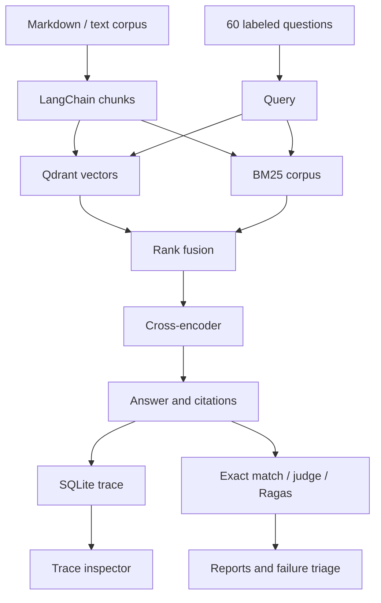

# RAG System

An observable retrieval system for answering questions from a document collection and diagnosing why answers fail. It combines vector search and BM25, reranks candidate chunks, validates cited evidence, and runs a labeled regression suite.

## What you can inspect

Every query produces a SQLite trace containing the query, candidate and selected chunks, source identifiers, cosine similarity, BM25 scores, reciprocal rank fusion scores, reranking scores, stage timings, answer, citations, validation results, model token usage and corpus fingerprint. A local dashboard lets you filter recent queries and inspect their full traces.

The evaluation harness reports exact-match correctness, source recall, MRR, nDCG, citation problems and optional LLM-judged correctness and Ragas faithfulness. Failures are grouped by category and linked to trace IDs. A triage export helps turn observed failures into human-reviewed regression cases.

## Quick start — no API key

```bash
git clone https://github.com/Jemade/RAG-SYSTEM.git
cd RAG-SYSTEM
python -m venv .venv
source .venv/bin/activate             # Windows: .venv\Scripts\activate
pip install -e '.[dev]'
rag-system ingest data/corpus
rag-system query "Which team owns NS-731?"
rag-system evaluate --output var/reports/baseline.json
rag-system triage var/reports/baseline.json
rag-system serve
```

Open **http://127.0.0.1:8000** for the trace inspector. API documentation is at `/docs`. Reports are written as JSON and Markdown. Commands run from the repository root; ingestion also accepts your own directory of UTF-8 `.md` and `.txt` files.

The default `demo` mode uses deterministic hashed token vectors, lexical overlap reranking and extractive answers. It exercises storage, instrumentation and evaluations without downloads or paid services. It is a deliberately limited baseline: it does not provide semantic embeddings, neural reranking or an LLM judge, and full-sentence extraction often fails strict short-value exact match. Do not interpret its scores as results for the semantic configuration.

## Semantic retrieval and LLM evaluations

```bash
# CPU-only Linux users can install CPU PyTorch first to avoid CUDA packages:
pip install torch --index-url https://download.pytorch.org/whl/cpu
pip install -e '.[models,evals,dev]'
export OPENAI_API_KEY="your-key"      # set privately; never commit it
export RAGAS_DO_NOT_TRACK=true
rag-system --root var/semantic --mode semantic ingest data/corpus
rag-system --root var/semantic --mode semantic query \
  "What safeguards apply before exporting confidential traces?" --model gpt-4o-mini
rag-system --root var/semantic --mode semantic evaluate \
  --model gpt-4o-mini --judge gpt-4o-mini --require-judge \
  --split dev --output var/reports/semantic-dev.json
rag-system --root var/semantic --mode semantic evaluate \
  --model gpt-4o-mini --judge gpt-4o-mini --require-judge \
  --split holdout --min-correctness 0.85 --output var/reports/semantic-holdout.json
rag-system --root var/semantic serve
```

`--model` and `--judge` accept OpenAI model IDs. Model access and suitability depend on your account. Generation and judging incur provider charges and send the question, evidence or reference to that provider. Choose an approved corpus before using external models. The semantic models download from Hugging Face on first use and then use the local cache. No fallback silently substitutes the demo models when a semantic model fails.

| Component | Implementation |
|---|---|
| Chunking | LangChain recursive text splitter, 800 characters / 120 overlap |
| Dense search | SentenceTransformers `all-MiniLM-L6-v2`, normalized 384-dimensional vectors |
| Vector storage | Persistent Qdrant local collection, cosine distance |
| Lexical search | `rank-bm25` BM25Okapi |
| Fusion | Reciprocal rank fusion, constant 60, up to 20 candidates per search |
| Neural reranking | CrossEncoder `ms-marco-MiniLM-L-6-v2`, top 20 fused candidates |
| Answering | OpenAI JSON response with answer, abstention and quoted citations |
| Scoring | Exact match; reference/rubric LLM judge; Ragas 0.4 faithfulness |
| Telemetry | SQLite with full retrieval traces and errors |
| Inspector | FastAPI + plain HTML/CSS/JavaScript, read-only trace API |

Cosine, BM25, fusion and cross-encoder scores have different meanings and scales. None should be presented as a probability that an answer is correct. BM25 is rebuilt per query in this small-corpus implementation; a larger deployment should cache it and batch ingestion.

## Architecture



## Evidence use: what the checks establish

Citation integrity checks that each citation identifies a retrieved chunk and quotes an exact nonempty substring from it. The trace records which chunks were cited. This detects fabricated identifiers or quotes, but does **not** prove causal use of the context or establish that every answer claim is supported. Ragas faithfulness independently checks answer claims against retrieved evidence. Both are useful signals, and neither replaces human review of consequential answers.

## Dataset and failure workflow

`data/corpus` is an authored **fictional Northstar operations handbook**, not real company documentation. `data/evaluation.jsonl` contains **60 labeled questions**: 40 exact factual/abstention cases and 20 open-ended cases, divided into 45 development and 15 holdout questions. Categories cover numeric facts, paraphrases, similar identifiers, archived policies, exceptions, negation, multi-hop evidence, missing answers and document prompt injection.

These are seed probes for anticipated failure modes. They are not claimed to originate from production traffic. The harness runs the pipeline without providing the reference answer to retrieval or generation; only the scorer receives it. Relevant sources are labeled at document level, so retrieval metrics measure source coverage rather than exact gold-span retrieval. Archived documents remain in the corpus to test conflicting evidence.

1. Inspect reports and the linked query traces.
2. Run `rag-system triage REPORT.json` to export observed failures.
3. Review the evidence and author a new question, correct answer, relevant sources and rubric in each proposed regression.
4. Append reviewed cases to your development dataset. Do not auto-promote generated answers to ground truth.
5. Compare reports with the same dataset fingerprint, corpus fingerprint, mode, models and top-k.
6. Reserve holdout cases for release decisions; do not tune against them.

Exact match normalizes case, punctuation and whitespace and compares the entire answer. Open-ended correctness remains `null` when no judge is configured. Judge errors are explicitly reported, never counted as passes. `--min-correctness` fails unless every selected case has a correctness score and the threshold is met. Pipeline and judge errors also cause a nonzero CLI exit. Generation quality and retrieval coverage are distinct signals; a failed exact match can coexist with successful retrieval.

## Inspector API authentication

Set `RAG_INSPECTOR_TOKEN` to require `Authorization: Bearer <token>` on `/api/traces` and `/api/traces/{trace_id}`. This protects the trace JSON endpoints but **the bundled browser inspector does not yet provide a token entry flow**; it will show a loading error when this variable is set. For now use a trusted local deployment or a properly configured authenticating reverse proxy for a remote interface. This is not multi-user authorization or tenant isolation.

## Operation and privacy

The inspector binds to localhost and has no authentication. Keep it local; public access requires authentication, authorization and a deployment design. Raw traces contain queries and document text. Do not ingest secrets or sensitive documents casually; apply your own retention and deletion policy to `var/traces.sqlite3`. Exception traces store exception types rather than provider messages to reduce accidental secret exposure. This does not redact sensitive text supplied in a query or corpus.

Qdrant local mode allows one process to own its directory. Run ingestion and queries sequentially against a given root. The inspector reads SQLite only and can run alongside the CLI. Re-ingestion writes a new vector collection before atomically switching the manifest, then removes old collections. Use separate roots for demo and semantic indexes. This is a local, single-user product; distributed serving, enterprise access controls and large-scale ingestion are future work.

## Development

```bash
ruff check .
ruff format --check .
pytest -q
```

GitHub Actions tests Python 3.11, 3.12 and 3.13, runs the baseline harness and uploads reports. CI verifies deterministic behavior without paid API calls or neural model downloads. Live LLM and judge results require configured credentials and are not implied by CI success.

See [VALIDATION.md](VALIDATION.md) for the checks actually performed and [data/README.md](data/README.md) for dataset provenance.

## Recorded run artifacts

[Offline baseline](examples/reports/baseline.md) and [neural retrieval with extractive generation](examples/reports/semantic-retrieval.md) are included with per-case JSON reports. Both runs completed all 60 queries. They are diagnostic examples, not claims of high answer accuracy; see the recorded limitations in [VALIDATION.md](VALIDATION.md).

## Contributing

See [CONTRIBUTING.md](CONTRIBUTING.md) for development checks, regression tests and review expectations. Use the issue templates for reproducible bugs or concrete feature proposals.

## Engineering and contribution guide

Read the [engineering notes](docs/ENGINEERING.md) for implementation boundaries and verification commands, the [review checklist](docs/REVIEW_CHECKLIST.md) for evidence still required, and [CONTRIBUTING.md](CONTRIBUTING.md) to propose changes. Report vulnerabilities through [SECURITY.md](SECURITY.md).

[](https://github.com/Jemade/RAG-SYSTEM/actions/workflows/repository-hygiene.yml)
